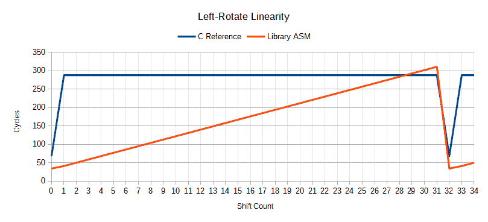

# Overview

This is a library for the STM8 microcontroller and [SDCC](http://sdcc.sourceforge.net/) compiler providing an assortment of pseudo-intrinsic functions for bit manipulation, counting, inspection, and calculation. All functions have been written in hand-optimised assembly code for the fastest possible execution speed.

Functions are provided for nibble/byte swapping, population count (i.e. count of 1 bits), counting of trailing/leading zero bits, find-first-set (i.e. index of first 1-bit), bit rotation, parity, simultaneous division quotient/remainder calculation, and constant-time string comparison.

In addition to the library functions, a test and benchmark program (in C) is also included that contains reference implementations for each library function, used to verify proper operation of the library functions and to benchmark against.

# Setup

You may either use a pre-compiled version of the library, or build the library code yourself. See below for further details.

This library has been written to accommodate and provide for both 'medium' (16-bit address space) and 'large' (24-bit address space) STM8 memory models.

* If you are building your project with either no specific SDCC memory model option, or the `--model-medium` option, then use the non-suffixed `utils.lib` library file.
* If you are building with `--model-large`, then use the `utils-large.lib` library file.

Unsure? If your target STM8 microcontroller model has less than 32KB of flash memory, then choose the former version; if larger flash, then you probably want the latter.

## Pre-compiled Library

1. Extract the relevant `.lib` file (see above) and `utils.h` file from the release archive.
2. Copy the two files to your project.

## Building

This library is developed and built with the [Code::Blocks](http://codeblocks.org/) IDE and [SDCC](http://sdcc.sourceforge.net/) compiler.

1. Load the `.cbp` project file in Code::Blocks.
2. Select the appropriate 'Library' build target for your STM8 memory model (see above) from the drop-down list on the compiler toolbar (or the *Build > Select Target* menu).
3. Build the library by pressing the 'Build' icon on the compiler toolbar (or Ctrl-F9 keyboard shortcut, or *Build > Build* menu entry).
4. Upon successful compilation, the resultant `.lib` file will be in the main base folder.
5. Copy the `.lib` file and the `utils.h` file to your project.

# Usage

1. Include the `utils.h` file in your C code wherever you want to use the library functions.
2. When linking, provide the path to the `.lib` file with the `-l` SDCC command-line option.

## Function Reference

### `uint8_t swap(const uint8_t value)`

The upper and lower nibbles (4 bits) of the input byte `value` are swapped and returned. For example, `0xAB` becomes `0xBA`.

### `uint16_t bswap_16(const uint16_t value)`

Returns `value` with the order of its bytes reversed. For example, `0xAABB` becomes `0xBBAA`.

### `uint32_t bswap_32(const uint32_t value)`

Returns `value` with the order of its bytes reversed. For example, `0xAABBCCDD` becomes `0xDDCCBBAA`.

### `uint8_t pop_count_8(uint8_t value)`

Counts and returns the number of 1-bits in the 8-bit argument `value`. For example, `0x8F` (`0b10001111`) will give a result of 5.

### `uint8_t pop_count_16(uint16_t value)`

Counts and returns the number of 1-bits in the 16-bit argument `value`. 

### `uint8_t pop_count_32(uint32_t value)`

Counts and returns the number of 1-bits in the 32-bit argument `value`. 

### `uint8_t ctz_8(uint8_t value)`

Counts and returns the number of trailing 0-bits in the 8-bit argument `value`, where 'trailing' means those bits in the least-significant positions. When the input is zero, the result is equal to the bit-width of the argument, 8. For example, `0x50` (`0b01010000`) will give a result of 4.

### `uint8_t ctz_16(uint16_t value)`

Counts and returns the number of trailing 0-bits in the 16-bit argument `value`. When the input is zero, the result is equal to the bit-width of the argument, 16.

### `uint8_t ctz_32(uint32_t value)`

Counts and returns the number of trailing 0-bits in the 32-bit argument `value`. When the input is zero, the result is equal to the bit-width of the argument, 32.

### `uint8_t clz_8(uint8_t value)`

Counts and returns the number of leading 0-bits in the 8-bit argument `value`, where 'leading' means those bits in the most-significant positions. When the input is zero, the result is equal to the bit-width of the argument, 8. For example, `0x0A` (`0b00001010`) will give a result of 4.

### `uint8_t clz_16(uint16_t value)`

Counts and returns the number of leading 0-bits in the 16-bit argument `value`. When the input is zero, the result is equal to the bit-width of the argument, 16.

### `uint8_t clz_32(uint32_t value)`

Counts and returns the number of leading 0-bits in the 32-bit argument `value`. When the input is zero, the result is equal to the bit-width of the argument, 32.

### `uint8_t ffs_8(uint8_t value)`

Finds the least-significant (i.e. first) 1-bit in the 8-bit argument `value` and returns its index plus one. If the input is zero, returns zero. For example, `0xE0` (`0b11100000`) will give a result of 6.

### `uint8_t ffs_16(uint16_t value)`

Finds the least-significant (i.e. first) 1-bit in the 16-bit argument `value` and returns its index plus one. If the input is zero, returns zero.

### `uint8_t ffs_32(uint32_t value)`

Finds the least-significant (i.e. first) 1-bit in the 32-bit argument `value` and returns its index plus one. If the input is zero, returns zero.

### `uint8_t rotate_left_8(uint8_t value, uint8_t count)`

Takes the input `value` and rotates it to the left by `count` bits. The operation is performed by doing a circular shift, such that each bit shifted off the left is shifted on to the right. For example, `0x33` rotated by 3 will give a result of `0x99`. Any `count` greater than the bit-width of `value` (8) will be reduced to `count` modulus 8 (e.g. 11 => 3), as the lesser number of rotations produce the exact same result. A `count` of zero will return the input unchanged. Note that when doing a rotation by 4, you can instead use `swap()`, which will give the same result but in a more efficient manner.

### `uint16_t rotate_left_16(uint16_t value, uint8_t count)`

Takes the input `value` and rotates it to the left by `count` bits. Any `count` greater than the bit-width of `value` (16) will be reduced to `count` modulus 16. A `count` of zero will return the input unchanged. Note that when doing a rotation by 8, you can instead use `bswap_16()`, which will give the same result but in a more efficient manner.

### `uint32_t rotate_left_32(uint32_t value, uint8_t count)`

Takes the input `value` and rotates it to the left by `count` bits. Any `count` greater than the bit-width of `value` (32) will be reduced to `count` modulus 32. A `count` of zero will return the input unchanged.

### `uint8_t rotate_right_8(uint8_t value, uint8_t count)`

Takes the input `value` and rotates it to the right by `count` bits. Any `count` greater than the bit-width of `value` (8) will be reduced to `count` modulus 8. A `count` of zero will return the input unchanged. Note that when doing a rotation by 4, you can instead use `swap()`, which will give the same result but in a more efficient manner.

### `uint16_t rotate_right_16(uint16_t value, uint8_t count)`

Takes the input `value` and rotates it to the right by `count` bits. Any `count` greater than the bit-width of `value` (16) will be reduced to `count` modulus 16. A `count` of zero will return the input unchanged. Note that when doing a rotation by 8, you can instead use `bswap_16()`, which will give the same result but in a more efficient manner.

### `uint32_t rotate_right_32(uint32_t value, uint8_t count)`

Takes the input `value` and rotates it to the right by `count` bits. Any `count` greater than the bit-width of `value` (32) will be reduced to `count` modulus 32. A `count` of zero will return the input unchanged.

### `uint8_t parity_even_8(uint8_t value)`

Calculates and returns a value of 0 or 1 representing the *even* parity of the 8-bit argument `value`. Note that this function is implemented as a macro based upon `pop_count_8()`.

### `uint8_t parity_even_16(uint16_t value)`

Calculates and returns a value of 0 or 1 representing the *even* parity of the 16-bit argument `value`. Note that this function is implemented as a macro based upon `pop_count_16()`.

### `uint8_t parity_even_32(uint32_t value)`

Calculates and returns a value of 0 or 1 representing the *even* parity of the 32-bit argument `value`. Note that this function is implemented as a macro based upon `pop_count_32()`.

### `uint8_t parity_odd_8(uint8_t value)`

Calculates and returns a value of 0 or 1 representing the *odd* parity of the 8-bit argument `value`. Note that this function is implemented as a macro based upon `pop_count_8()`.

### `uint8_t parity_odd_16(uint16_t value)`

Calculates and returns a value of 0 or 1 representing the *odd* parity of the 16-bit argument `value`. Note that this function is implemented as a macro based upon `pop_count_16()`.

### `uint8_t parity_odd_32(uint32_t value)`

Calculates and returns a value of 0 or 1 representing the *odd* parity of the 32-bit argument `value`. Note that this function is implemented as a macro based upon `pop_count_32()`.

### `void div_s16(int16_t x, int16_t y, div_s16_t *result)`

Calculates simultaneously both the quotient and the remainder of the *signed* integer division of dividend `x` by divisor `y`. The result is placed in the `div_s16_t` structure pointed to by `result`; the structure contains two `int16_t` members named `quot` and `rem`. Be warned that when dividing by zero, the resulting values will be indeterminate.

### `void div_u16(uint16_t x, uint16_t y, div_u16_t *result)`

Calculates simultaneously both the quotient and the remainder of the *unsigned* integer division of dividend `x` by divisor `y`. The result is placed in the `div_u16_t` structure pointed to by `result`; the structure contains two `uint16_t` members named `quot` and `rem`. Be warned that when dividing by zero, the resulting values will be indeterminate.

### `void div_u32(uint32_t x, uint32_t y, div_u32_t *result)`

Calculates simultaneously both the quotient and the remainder of the *unsigned* integer division of dividend `x` by divisor `y`. The result is placed in the `div_u32_t` structure pointed to by `result`; the structure contains two `uint32_t` members named `quot` and `rem`. Be warned that when dividing by zero, the resulting values will be indeterminate.

### `int strctcmp(const char *s1, const char *s2)`

Performs a comparison between two null-terminated byte strings in *constant-time*. That is, the comparison operation will take the same number of execution cycles regardless of whether the strings are equal or not. Returns zero if `s1` and `s2` compare equal, or a non-zero value if not. A non-zero value is also returned where either `s1` or `s2` are null pointers. Note that this function does not compare lexicographically (like `strcmp`) - the return value cannot be used to determine lexicographical order (i.e. whether `s1` is ordered before or after `s2`).

## Function Remarks

For the `div_s16`, `div_u16`, and `div_u32` functions, an output argument is used to return the result because SDCC does not (at time of writing) support passing structs by value as function arguments or returning them from functions. This is the reason why standard functions `div`, `ldiv`, etc. are not included in SDCC's standard library.

## Aliases

For convenience, the following aliases are provided (via macro definitions) to some of the library functions. These aliases match the names of functions provided on other platforms by standard C libraries or compiler built-ins.

```c
#define popcount(x) pop_count_16(x)
#define popcountl(x) pop_count_32(x)
#define ctz(x) ctz_16(x)
#define ctzl(x) ctz_32(x)
#define clz(x) clz_16(x)
#define clzl(x) clz_32(x)
#define ffs(x) ffs_16(x)
#define ffsl(x) ffs_32(x)
#define parity(x) parity_even_16(x)
#define parityl(x) parity_even_32(x)
#define div(x, y, r) div_s16(x, y, r)
```

## Example

```c
#include <stdint.h>
#include "utils.h"

void main(void) {
    uint32_t foo;
    uint8_t bar;
    div_u32_t baz;
    foo = 0xAABBCCDD;
    foo = bswap_32(foo); // returns 0xDDCCBBAA
    bar = popcount_32(foo); // returns 20
    bar = rotate_right_8(bar, 3); // returns 130
    div_u32(4539778UL, 100000UL, &baz); // outputs quotient 45 and remainder 39778 to baz
}
```

# Benchmarks

To benchmark the library functions, the execution speed of each was compared with that of it's associated plain C reference implementation (see `ref.c`). Each function was run for 10,000 iterations and the total number of processor execution cycles measured.

| Function        | Reference C | Library ASM | Ratio |
| --------------- | ----------: | ----------: | ----: |
| swap            |     470,011 |     270,011 |   57% |
| bswap_16        |     430,011 |     330,011 |   77% |
| bswap_32        |   1,300,018 |     410,017 |   32% |
| pop_count_8     |     790,011 |     300,011 |   38% |
| pop_count_16    |   1,770,011 |     410,010 |   23% |
| pop_count_32    |   6,160,018 |     570,018 |    9% |
| ctz_8           |     680,010 |     300,011 |   44% |
| ctz_16          |   1,030,010 |     370,011 |   36% |
| ctz_32          |   3,170,018 |     510,018 |   16% |
| clz_8           |     680,011 |     290,011 |   43% |
| clz_16          |   1,850,011 |     370,010 |   20% |
| clz_32          |   5,830,018 |     480,018 |    8% |
| ffs_8           |     870,011 |     490,010 |   56% |
| ffs_16          |   1,230,011 |     570,011 |   46% |
| ffs_32          |   3,510,017 |     780,018 |   22% |
| rotate_left_8   |     890,011 |     690,011 |   78% |
| rotate_left_16  |   1,470,011 |   1,170,011 |   80% |
| rotate_left_32  |   3,130,017 |   2,570,018 |   82% |
| rotate_right_8  |     880,011 |     690,011 |   78% |
| rotate_right_16 |   1,360,011 |   1,230,011 |   90% |
| rotate_right_32 |   3,180,018 |   2,910,017 |   92% |
| div_s16         |   1,460,018 |     970,022 |   66% |
| div_u16         |     860,021 |     710,018 |   83% |
| div_u32         |  22,220,017 |  11,940,018 |   54% |
| strctcmp        |         N/A |         N/A |   N/A |

The benchmark was run using the [μCsim](http://mazsola.iit.uni-miskolc.hu/~drdani/embedded/ucsim/) microcontroller simulator included with SDCC, and measurements were obtained using the timer commands of the simulator.

Other notes:

* The count of cycles consumed shown here includes the loop iteration, but for the purposes of comparison, because it is a common overhead and counts equally against both implementations, this can be ignored.
* All C code was compiled using SDCC's default 'balanced' optimisation level (i.e. with neither `--opt-code-speed` or `--opt-code-size`).
* Where library ASM functions have multiple alternate implementations, the fastest (typically table-look-up-based) was used.
* Benchmark figures for `strctcmp` are not applicable, as in that case the benchmark is used not to compare execution speed, but instead to determine that comparisons of equal and non-equal strings execute in the same number of cycles.

It is also worth making some remarks regarding the apparent slim improvement of the left- and right-rotation functions. The benchmark result is slightly unrepresentative here due to the choice of input value used in the benchmark code. Different input values would produce different results, because the execution speed of the library function scales linearly with rotation count (whereas the reference C implementation is effectively constant-time). This can be clearly seen in the graph below.



It can be argued that non-linearity of execution speed is a desirable trait for certain use cases (e.g. cryptography), but due to the nature of the target platform of this library (8-bit microcontrollers), such things are not a concern.

Another area also worth commenting on is regarding the benchmarks of `div_s16` and `div_u16`. The μCsim simulator does not accurately simulate the STM8's `DIVW` instruction (as used by those functions) in terms of number of cycles consumed. The *STM8 CPU Programming Manual (PM0044)* documents that `DIVW` can take between 2 and 17 cycles depending on the values operated on, whereas μCsim (at time of writing, as of SDCC v4.1.0) always [counts it as taking 11 cycles](https://sourceforge.net/p/sdcc/code/HEAD/tree/tags/sdcc-4.1.0/sdcc/sim/ucsim/stm8.src/inst.cc#l706) regardless of operand values. Therefore, the benchmark results for `div_s16` and `div_u16` will not accurately reflect performance on real hardware. The `div_u32` function uses a binary long division algorithm, so is not affected.

# Code Size

Generally, the functions provided by this library have been written in a manner that prioritises execution speed over size of code (i.e. how much flash memory they occupy). However, for some functions, accommodations have been made for those who wish to prioritise size over speed, with alternate implementations available that occupy lesser amounts of flash memory.

The usage of these alternate implementations requires re-compilation of the library (see [Building](#building)). They are controlled by global macro definitions (or their absence), which must be changed (or removed) before re-compiling. See below for which definitions control which alternate function implementations.

## Population Count Functions

The implementation that is used for the population count functions is controlled by the following definitions:

* When `POP_COUNT_LUT_LARGE` is defined, a 128-byte look-up table is used. This is the fastest method, and the default for this library.
* When `POP_COUNT_LUT_SMALL` is defined, a smaller 16-byte look-up table is used. Trades speed for size; smaller than, but not as fast as the 'large' LUT implementation; faster than the fallback iterative method.
* If neither of the above are defined, an iterative method is used, which has the smallest size, but is slowest.

Should multiple definitions exist, the included implementation is prioritised according to the listing order above.

## Count of Trailing Zeroes Functions

The implementation used for functions that count trailing zeroes is controlled by the following definition:

* When `CTZ_LUT_LARGE` is defined, a 128-byte look-up table is used. This is the fastest method, and the default for this library.
* If not defined, an iterative method is used, which has a smaller size, but is slower.

## Count of Leading Zeroes Functions

The implementation used for functions that count leading zeroes is controlled by the following definition:

* When `CLZ_LUT_LARGE` is defined, a 128-byte look-up table is used. This is the fastest method, and the default for this library.
* If not defined, an iterative method is used, which has a smaller size, but is slower.

# Test Program

A test and benchmark program, `main.c`, is included in the source repository. It is designed to be run with the [μCsim](http://mazsola.iit.uni-miskolc.hu/~drdani/embedded/ucsim/) microcontroller simulator included with SDCC, but should also run on physical STM8 hardware that uses an STM8S208RBT6 (such as ST's Nucleo-64 development board equipped with this chip).

The program will run tests, using a variety of input data, on each library function and compare it's output value to that of the associated plain-C reference function (see `ref.c`). A string of "PASS" or "FAIL" is given, depending on whether the values match. At the conclusion of all tests, total pass/fail counts will be output.

For details of the benchmark part of the program, please see the [Benchmarks](#benchmarks) section. Please note that the benchmark is only really designed to be run under the μCsim simulator.

When executing in μCsim, all output from the program is directed to the simulator console. When executing on physical hardware, all output is transmitted on UART1.

# Licence

This library is licensed under the MIT Licence. Please see file LICENSE.txt for full licence text.